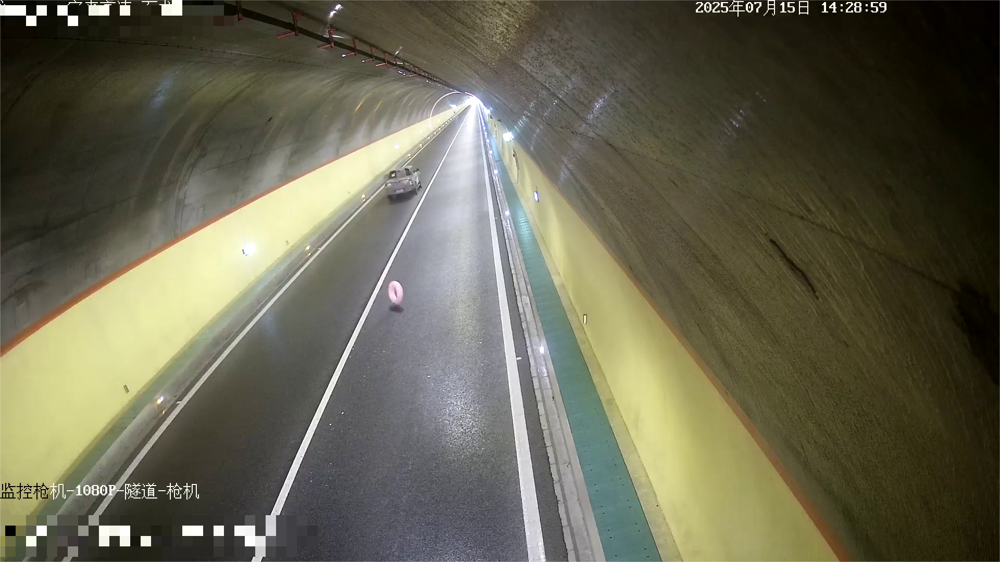

# HAVE-Dataset
**H**ighway **A**ll-scenario **V**ideo **E**vents Dataset. 高速公路全场景视频事件数据集。

HAVE 数据集是专为高速公路场景下多场景、多事件分析而构建的大规模视频数据集。数据集全面覆盖多种复杂环境和交通事件，包括隧道、桥梁、外场、收费站、服务区、白天、夜晚、雨雪雾天气，以及事故、施工、拥堵、边坡、停车、逆行、烟火等典型交通事件。

数据集旨在推动智能交通、自动驾驶、交通事件检测等领域的研究与应用，为视频理解、场景识别、交通异常检测等任务提供高质量、多样化、精准标注的真实高速公路视频数据。

> “一套数据，尽览高速公路全场景与事件——HAVE，尽在掌握。”

## 数据集特点
- 完整细致的标签体系，涵盖场景、天气和交通事件；
- 覆盖多种高速公路环境与复杂交通事件；
- 适用于视频理解、场景识别、交通异常检测等多种任务。

## 数据集规格
- 数据集中视频文件包含`MP4/H264`两种格式，每个视频时长`1分钟`左右，以`25FPS`、`1920*1080P`居多；
- 数据集中视频文件以`label-ids.文件后缀`规则命名，比如`1_5_9_11_14.mp4`表示`白天桥梁侧拍视角下雨天气出现交通拥堵路况`的数据，`2_8_18.h264`表示`夜晚立交互通场景出现烟火事件`的数据；
- 数据集中视频文件数量超过2000个（持续扩充中），其中各标签占比并不完全一致，特殊标签如`烟火`、`边坡`占比较小。

## 数据集示例
| 分类 | ID | 标签 | 示例 | 说明 |
| --- | --- | --- | --- | --- |
| 时间 | 1 | 白天 |  | 白天 |
| | 2 | 夜晚 |  | 夜晚（黑白图居多） |
| 场景 | 3 | 外场 |  | 外场主线场景 |
| | 4 | 隧道 |  | 隧道场景（含不同亮度） |
| | 5 | 桥梁 |  | 桥梁场景 |
| | 6 | 服务区 |  | 服务区场景 |
| | 7 | 收费站 |  | 收费站场景 |
| | 8 | 立交互通 |  | 立交互通场景 |
| 视角 | 9 | 侧拍 |  | 侧拍视角（外场立杆12米，隧道壁4米） |
| | 10 | 正拍 |  | 正拍视角（外场门架8米，隧道顶6米） |
| 天气 | 11 | 雨 |  | 画面下雨（不区分下雨程度） |
| | 12 | 雪 |  | 画面下雪（不区分下雪程度） |
| | 13 | 雾 |  | 画面起雾（不区分起雾程度） |
| 事件 | 14 | 拥堵 |  | 画面存在拥堵 |
| | 15 | 施工 |  | 画面存在施工 |
| | 16 | 事故 |  | 画面存在事故（翻车/追尾/撞击护栏） |
| | 17 | 边坡塌方 |  | 画面存在边坡塌方 |
| | 18 | 烟火 |  | 画面存在烟火 |
| | 19 | 停车 |  | 画面存在停车 |
| | 20 | 逆行 |  | 画面存在逆行（倒车） |
| | 21 | 行人 |  | 画面存在行人 |
| | 22 | 摩托车 |  | 画面存在摩托车 |
| | 23 | 抛洒物 |  | 画面存在抛洒物（轮胎、纸箱、垃圾袋等不明确物体） |

## 使用说明
本数据集使用方式，具体请联系原作者：微信zhzhi78。